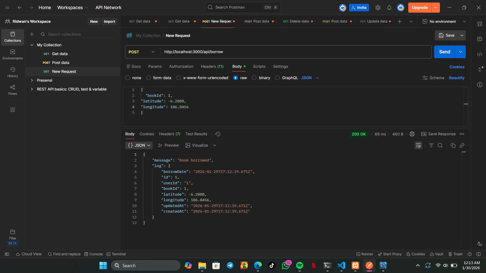
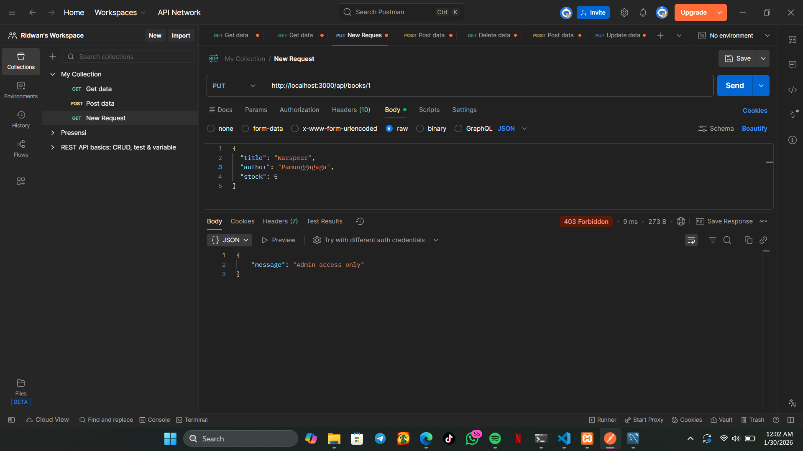
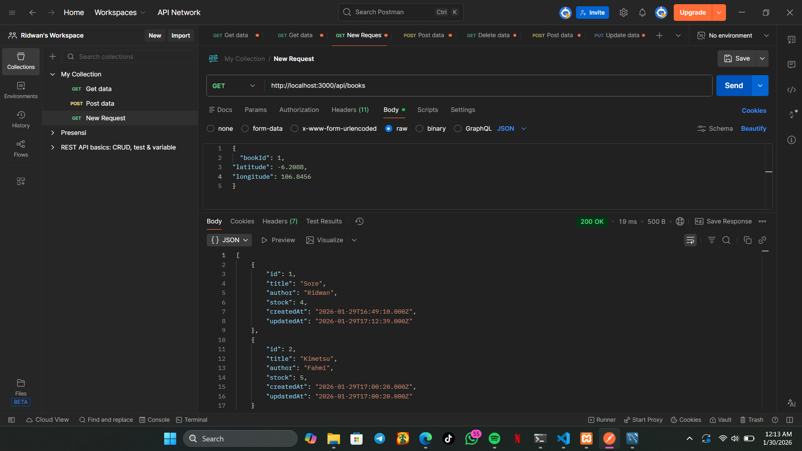
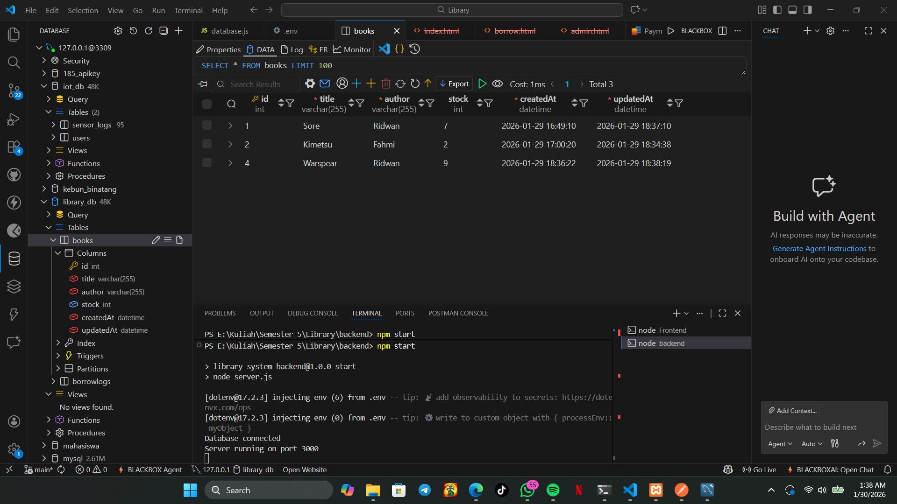
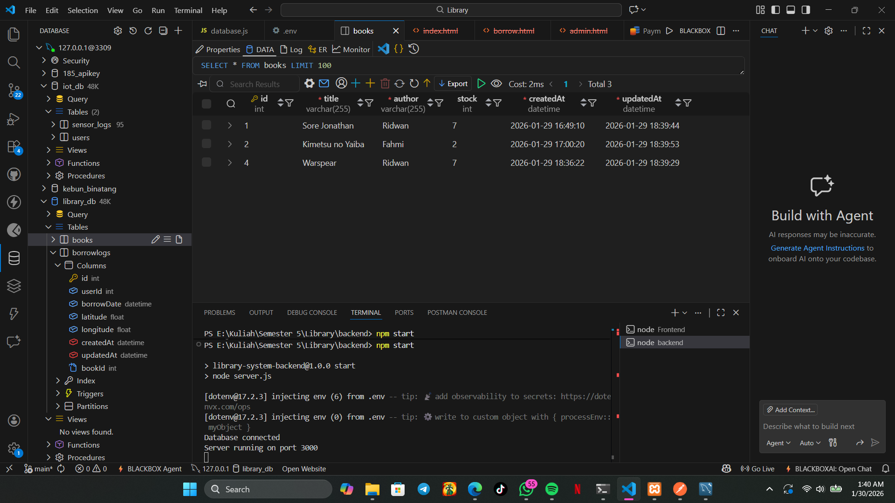
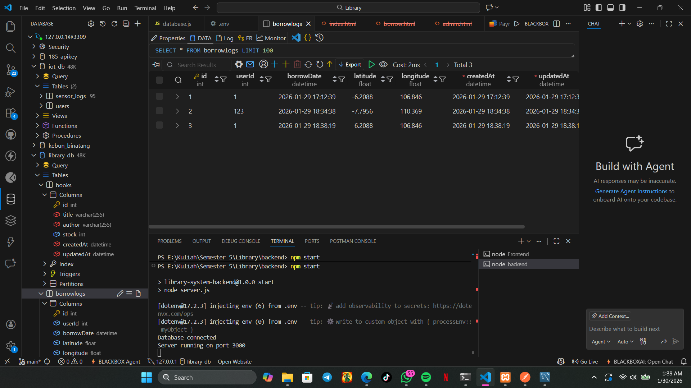
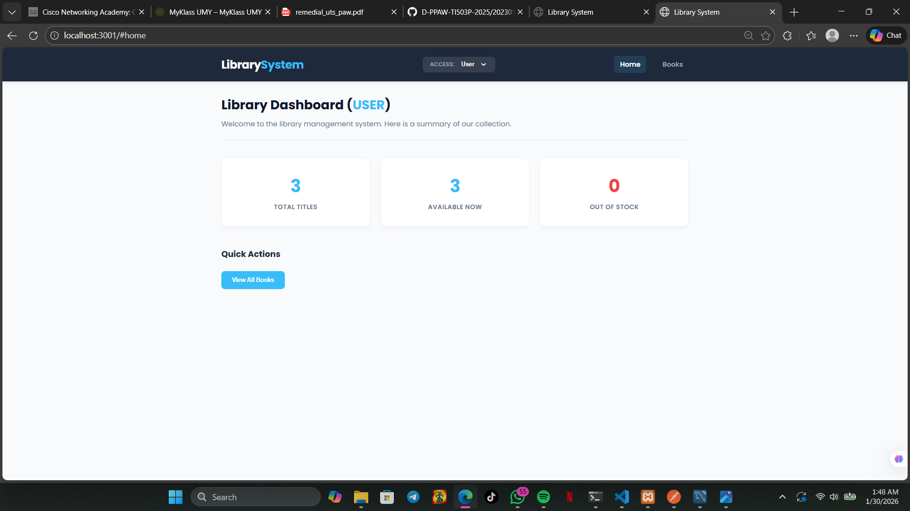
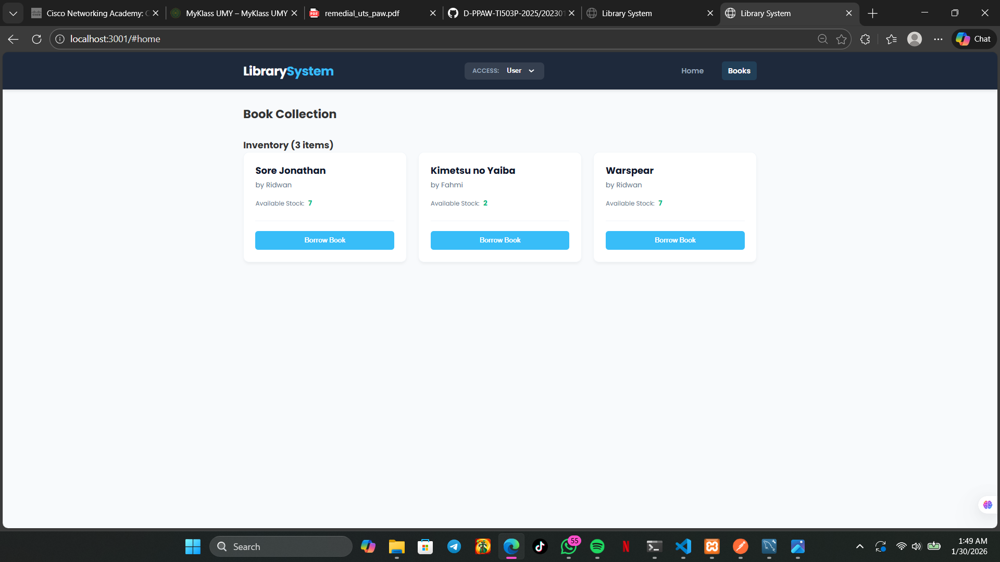
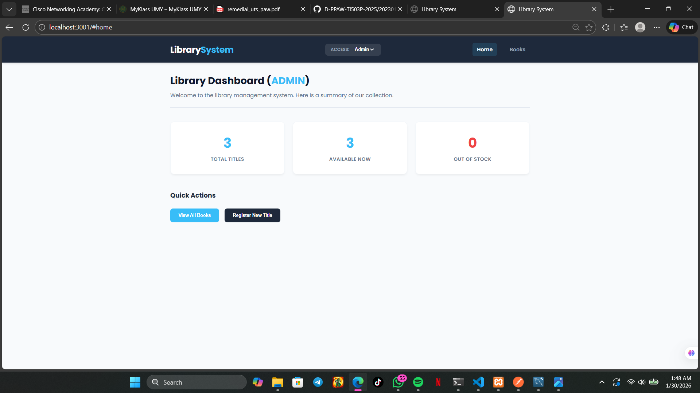
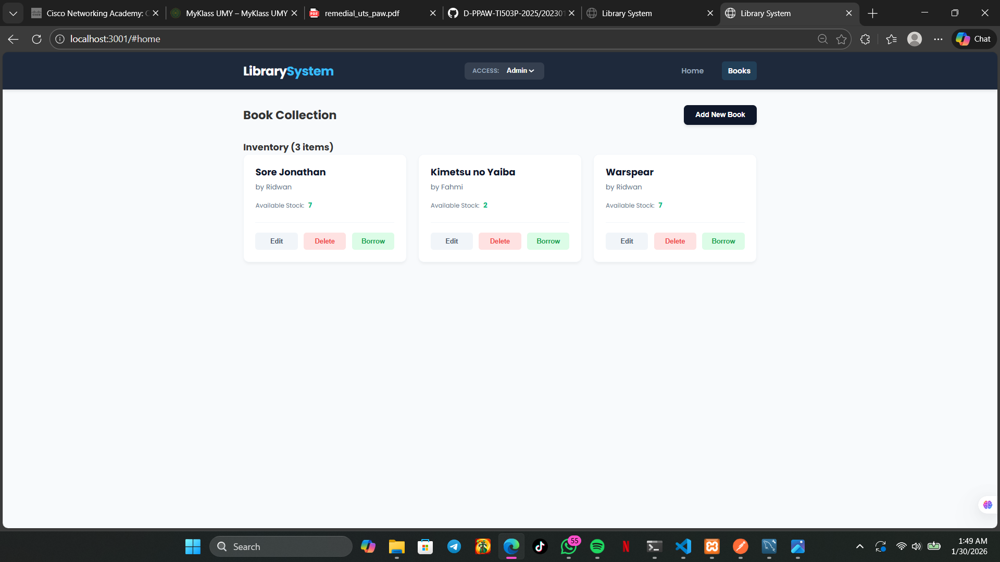

 # INSTRUKSI CARA MENJALANKAN APLIKASI
 1. Buka folder Library menggunakan Visual Studio Code
 2. Buka terminal
 3. Masuk ke directory Backend (cd Backend)
 4. Jalankan Backend (npm start)
 5. Buka terminal baru
 6. Masuk ke directory Frontend (cd Frontend)
 7. Jalankan Frontend (npm start)
 8. Aplikasi berjalan

# Dokumentasi LIBRARY SYSTEM WITH GEOLOCATION 

## BACKEND
## Public
1. Melihat Semua Buku

2. Melihat Detail Buku

## Admin Mode
3. Tambah Buku

4. Update Buku

5. Delete Buku 

## User Mode
6. Meminjam Buku

## Tambahan
7. Validasi Input Tittle dan Author tidak boleh kosong

8. Hanya Admin yang bisa Create, Update, Delete

9. Stok Berkurang Setelah User Meminjam Buku
Sebelum

Setelah Dipinjam

## Struktur Tabel
10. Tabel Buku 
sebelum di update

setelah di update

11. Tabel BorrowLog

## FRONTEND
## Public dan User
12. Dashboard 

13. Halaman Buku

Disini tampilan halaman buku untuk public dan user sama, cuma bedanya kalo public dia tidak bisa meminjam buku

## Admin
14. Dashboard

15. Halaman Buku Admin

